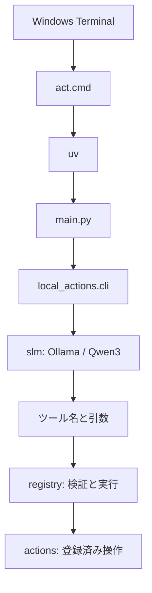

# Local Actions

GoogleのFunctionGemma Mobile Actionsに着想を得た、個人用の自然言語ショートカットです。

Windows Terminalから日本語で指示すると、ローカル小型言語モデルが登録済みの操作と引数へ変換し、ブラウザ検索や許可済みのWindows操作を実行します。専用GUIやChrome拡張は使用しません。

> Status: MVP開発中  
> Last updated: 2026-07-03

## 現在できること

次の操作を実装しています。

| 操作 | 関数 | 例 |
|---|---|---|
| Googleマップ検索 | `google_maps_search(query)` | `act 大分駅の近くのカフェを地図で探して` |
| Xを開く | `x_open(destination, query)` | `act XでFunctionGemmaを検索して` |
| 指定フォルダを開く | `open_folder(folder)` | `act OneDriveの保存先を開いて` |
| テキストをコピー | `copy_text(text)` | `act 「牛乳を買う」をコピーして` |
| クリップボードを表示 | `get_clipboard_text()` | `act クリップボードの内容を見せて` |
| Excel INBOXへ保存 | `capture(kind, title, body)` | `act 「買い物」をメモして` |
| カレンダーに登録 | `create_calendar_task(start_time, entity_type, title, body)` | `act 明日15時に「田中さんに返信」をタスク登録して` |
| PCをロック | `lock_pc()` | `act PCをロックして` |
| 表示中ページを取得 | `get_current_page()` | `act 今のページを保存して` |

`x_open()`の`destination`は`search`、`home`、`profile`、`likes`のいずれかです。
`search`では`query`を検索語として使います。`profile`と`likes`のユーザー名は
環境変数`LOCAL_ACTIONS_X_USERNAME`から取得し、SLMには渡しません。

現在のPowerShellセッションで設定する場合:

```powershell
$env:LOCAL_ACTIONS_X_USERNAME = "your_username"
```

先頭の`@`は付けても付けなくても構いません。英数字とアンダースコアからなる
15文字以内のXユーザー名だけを受け付けます。未設定または不正な場合は、
ブラウザを開かずエラーにします。

次は固定構文で実行する直コマンドです。SLMやOllamaは使用しません。

| コマンド | 固定処理 |
|---|---|
| `act tmpdelete` / `act tmp削除` | `%TMP%`直下を削除する。使用中などで削除できない項目はスキップする |
| `act wslcomp` / `act WSL圧縮` | WSL内のDockerから未使用image、volume、build cacheを削除し、WSL停止後に固定VHDXを圧縮する |
| `act settings <page>` / `act 設定 <page>` | 許可済みのWindows設定ページを開く |
| `act sysinfo` / `act システム情報` | システム情報を表示する |
| `act emptytrash` / `act ゴミ箱を空にする` | 確認後にゴミ箱を空にする |

`wslcomp`はWSL内で`docker image prune --all --force`、
`docker volume prune --force`、`docker builder prune --force`を順に実行します。
その後`wsl --shutdown`を実行し、
DiskPartで`%LOCALAPPDATA%\wsl\{7d85f156-a5cc-4896-83aa-8636104c220d}\ext4.vhdx`
を圧縮します。DiskPartの起動時にはWindowsの管理者権限確認が表示されます。

`capture()`はメモ（`memo`）またはログ（`log`）を、OneDrive内のExcel
INBOXへ追記します。

```text
OneDrive/
└── Local Actions/
    └── inbox.xlsx
```

列は`timestamp`、`kind`、`title`、`body`の4列です。記録時刻はPython側で
付与します。OneDriveへサインインしていない場合は保存せず、エラーを表示します。

`get_current_page()`は直近のChromeまたはEdgeウィンドウからページタイトルとURLを
取得します。「今のページを保存して」という依頼は
`get_current_page → capture`のチェーンとして実行されます。

`open_folder()`で開けるフォルダは、OneDriveの保存先（`onedrive`）とダウンロードフォルダ（`downloads`）に限定しています。対象はPython側の許可リストへ追加できます。

`settings`で指定できる`page`は、`system`、`display`、`sound`、
`notifications`、`network`、`bluetooth`、`apps`、`default_apps`、
`storage`、`power`、`privacy`、`windows_update`に限定しています。

`emptytrash`は完全削除を伴うため、実行前に必ずターミナルで確認します。`y`または`yes`を入力した場合だけ実行し、それ以外はキャンセルします。

`lock_pc()`は確認なしで即座に現在のWindowsセッションをロックします。

`create_calendar_task()`は開始日時、種別（タスクまたはリマインダ）、件名、本文から
ICSファイルを生成し、既定のカレンダーアプリ（Outlookなど）で確認画面を開きます。
最終的な登録はユーザーが確認画面で行います。開いたあとの一時ICSはすぐ削除し、
削除できなかった場合は次回の`act`起動時にまとめて削除します。開始時刻が明示されない
依頼では、時間帯に応じた既定の開始時刻をSLMへ提示します。

カレンダーの本文（`body`）には、クリップボードなど直前の操作結果を
Pythonの実行器が注入できます。依頼文に本文が
示されていればSLMが`body`へ入れ、両方が揃った場合は「モデルが入れた本文」+改行+
`===`+改行+「注入された本文」の順に結合し、ICSの`DESCRIPTION`へ入れます。
クリップボードの実データはSLMへ渡しません。

```powershell
act クリップボードの内容といっしょに「田中さんに返信」ってタスクを登録
```

```json
{
  "steps": [
    {
      "operation": "get_clipboard_text"
    },
    {
      "operation": "create_calendar_task",
      "start_time": "2026-07-03T15:00:00",
      "entity_type": "タスク",
      "title": "田中さんに返信"
    }
  ]
}
```

Action関数自体はクリップボードへ依存しません。`body`が渡されなければ既定値の
空文字を使い、本文なしで登録します。複数Actionは最大3個とし、後続Actionが
`accepts_previous_as`で宣言した引数へ直前の戻り値を渡します（既にモデルが
その引数を埋めている場合は上書きせず結合します）。
`get_clipboard_text`と`get_current_page`はパススルーに対応し、両方の結果を
取得する3段チェーンでは各結果を改行、`===`、改行で連結して`capture`または
`create_calendar_task`へ渡します。

## 完成時の利用イメージ

Windows Terminalを開き、どのフォルダにいても次のように実行します。

```powershell
act 大分駅の近くのカフェを地図で探して
```

モデルが次のようなツール呼び出しへ変換し、GoogleマップをChromeの新しいタブで開きます。

```json
{
  "operation": "google_maps_search",
  "query": "大分駅の近くのカフェ"
}
```

## 構成



各要素の役割は次のとおりです。

| 要素 | 役割 |
|---|---|
| `main.py` | CLIを起動するエントリーポイント |
| `local_actions/cli.py` | 入力、選択、実行、ログ保存の流れを制御 |
| `local_actions/slm.py` | Ollama上のSLMを呼び出し、ツールと引数を選択 |
| `local_actions/registry.py` | 許可リスト、引数検証、安全設定、ツール実行 |
| `local_actions/actions.py` | URL生成やWindows操作などの登録対象関数 |
| `local_actions/action_log.py` | JSON Lines形式の実行ログを保存 |
| Ollama | ローカルモデルの実行基盤 |
| `qwen3:1.7b` | 日本語の指示からツールと引数を選択 |
| `uv` | Python、仮想環境、依存ライブラリの管理 |
| `act.cmd` | 長い起動コマンドを`act`として呼び出す入口 |
| Chrome | 検索結果や指定ページの表示。Windowsの既定ブラウザとして使用 |

## 使用環境

今回、動作を確認した環境です。

| 項目 | 内容 |
|---|---|
| OS | Windows |
| Python | 3.13.3 |
| Ollama | 0.30.11 |
| uv | 0.11.25 |
| モデル | `qwen3:1.7b` |
| モデル形式 | Q4_K_M量子化、約1.4GB |
| ブラウザ | Google ChromeをWindowsの既定ブラウザに設定 |

## セットアップ

### 1. Ollama

Windows版Ollamaをインストールします。

- <https://ollama.com/download/windows>

PowerShellを開き直し、動作を確認します。

```powershell
ollama --version
```

モデルを取得します。

```powershell
ollama pull qwen3:1.7b
```

確認:

```powershell
ollama list
```

### 2. uv

WinGetでuvをインストールします。

```powershell
winget install --id=astral-sh.uv -e
```

PowerShellを開き直し、動作を確認します。

```powershell
uv --version
```

### 3. Pythonプロジェクト

今回のプロジェクトは次の場所にあります。

```text
%USERPROFILE%\workspace
```

初期化:

```powershell
cd "$HOME\workspace"
uv init --app
uv add ollama
```

現在の主なファイルとフォルダは次のとおりです。

```text
workspace/
├── .venv/
├── local_actions/
│   ├── action_log.py
│   ├── actions.py
│   ├── cli.py
│   ├── registry.py
│   └── slm.py
├── main.py
├── pyproject.toml
├── test_main.py
├── uv.lock
└── README.md
```

## 開発用の実行方法

プロジェクト内から直接実行する場合:

```powershell
cd "$HOME\workspace"
uv run main.py 大分駅の近くのカフェを地図で探して
```

引数を付けずに起動すると、`指示>`の入力待ちになります。

```powershell
uv run main.py
```

## `act`コマンド

### 目的

開発用の次のコマンドは長く、プロジェクトの場所も意識する必要があります。

```powershell
uv run --project "$HOME\workspace" "$HOME\workspace\main.py" ...
```

これを、どのフォルダからでも次の形で実行できるようにしています。

```powershell
act ...
```

登録済み操作の関数名、引数、説明を一覧表示する場合は、`--list`または`-l`を使います。
この表示ではOllamaへの接続や操作の実行は行いません。

```powershell
act --list
```

通常の`act`実行は、入力、選択された操作、引数、実行状態、戻り値またはエラーを
UTF-8のJSON Lines形式で次のファイルへ追記します。`--list`の表示は記録しません。

```text
OneDrive\
└── Local Actions\
    └── actions.jsonl
```

1行が1回の実行に対応するため、PowerShellでは次のように確認できます。

```powershell
Get-Content "$env:OneDrive\Local Actions\actions.jsonl" -Encoding utf8
```

保存先を一時的に変更する場合は、環境変数`LOCAL_ACTIONS_LOG_PATH`へファイルパスを
指定します。ログを保存できなかった場合は標準エラーへ警告を表示しますが、
操作自体の結果やエラーは変更しません。OneDriveへサインインしていない場合も
ログは保存されず、同じ警告を表示します。

### 配置場所

現在の`act.cmd`は次の場所にあります。

```text
%USERPROFILE%\AppData\Local\Microsoft\WinGet\Links\act.cmd
```

`Get-Command uv`で、同じフォルダにある`uv.exe`が使用されていることを確認しました。

```powershell
(Get-Command uv).Source
```

確認されたパス:

```text
%USERPROFILE%\AppData\Local\Microsoft\WinGet\Links\uv.exe
```

このフォルダが環境変数`PATH`に含まれていれば、PowerShellは現在のフォルダに関係なく`act.cmd`を発見できます。PATHは再帰的には検索されないため、`act.cmd`はPATH対象フォルダの直下に置きます。

PATHの確認:

```powershell
$env:PATH -split ";" | Where-Object { $_ -like "*WinGet\Links*" }
```

コマンド解決の確認:

```powershell
Get-Command act
```

### `act.cmd`の内容

```bat
@echo off
"%~dp0uv.exe" run --project "%USERPROFILE%\workspace" "%USERPROFILE%\workspace\main.py" %*
```

各部分の意味:

| 記述 | 意味 |
|---|---|
| `@echo off` | 内部で実行するコマンドを画面に表示しない |
| `%~dp0uv.exe` | `act.cmd`と同じフォルダにある`uv.exe` |
| `%USERPROFILE%\workspace` | 現在のユーザーのプロジェクトフォルダ |
| `%*` | `act`の後ろに入力されたすべての引数 |

`act.cmd`を別のPATH対象フォルダへ移す場合は、`uv`もPATHから解決できます。

```bat
@echo off
uv run --project "%USERPROFILE%\workspace" "%USERPROFILE%\workspace\main.py" %*
```

## PowerShellプロファイル方式について

最初は、PowerShellのプロファイルに次の関数を登録する方法を試しました。

```powershell
function act {
    uv run --project "$HOME\workspace" "$HOME\workspace\main.py" @args
}
```

対象ファイル:

```text
%USERPROFILE%\OneDrive\ドキュメント\WindowsPowerShell\Microsoft.PowerShell_profile.ps1
```

しかし、この環境ではPowerShellスクリプトの実行が無効で、プロファイルを読み込めませんでした。

```text
PSSecurityException: このシステムではスクリプトの実行が無効
```

`CurrentUser`の実行ポリシーを`RemoteSigned`へ変更すれば利用できますが、その変更は`act`だけでなく、現在のユーザーが実行するすべてのPowerShellスクリプトに影響します。

今回は影響範囲を限定するため、PowerShellプロファイル方式を採用せず、`act.cmd`方式へ切り替えました。

プロファイルに上記の`act`関数だけを追加している場合、その関数は不要です。ほかの設定がある場合はファイル全体を削除せず、`act`関数だけを削除します。

現在のPowerShellセッションに古い関数が残っている場合:

```powershell
Remove-Item Function:\act -ErrorAction SilentlyContinue
```

## モデル選定

### なぜ最初からFunctionGemmaを使わなかったか

FunctionGemmaはGemma 3 270Mを関数呼び出し向けに調整したモデルで、今回の構想に最も近いモデルです。一方、GoogleのMobile Actions公開データセットは英語で、FunctionGemmaは用途固有の追加学習を前提としています。

初期MVPでは、まず次を検証する必要がありました。

1. 日本語の自然文を理解できること
2. 登録済みツールから適切なものを選べること
3. 日本語の検索語を引数として保持できること
4. Ollamaからすぐ実行できること

このため、100以上の言語とツール利用に対応し、Ollama公式ライブラリから取得できる`qwen3:1.7b`を暫定採用しました。

これは最終モデルの決定ではありません。操作ログと修正データが蓄積した段階で、FunctionGemmaなどの小型専用モデルへ移行する余地を残しています。

### 量子化

現在の`qwen3:1.7b`はQ4_K_M量子化済みで、保存容量は約1.4GBです。

量子化済みモデルはMVPの実行確認に使います。将来ファインチューニングする場合は、Ollama上の量子化モデルを直接学習するのではなく、元モデルまたは学習用形式を使って追加学習し、その成果物を改めて量子化してOllamaへ載せる想定です。

## 実装上の判断

### OllamaのTool CallingとStructured Outputsを使用

最初の確認では、モデルへ操作一覧を文章で渡し、JSONだけを返すよう指示しました。

```json
{
  "operation": "google_maps_search",
  "query": "大分駅の近くにあるカフェ"
}
```

単発Actionの初期実装では、Ollama公式のTool Callingを使用していました。
複数Actionでは`qwen3:1.7b`が複数のTool Callを安定して返さなかったため、
現在は登録済みActionから生成したJSON SchemaをStructured Outputsへ渡し、
順序付きのAction計画を取得します。実際の関数呼び出し、引数検証、前段結果の注入は
Python側だけで行います。

### 日本語保持

初回テストでは操作の選択自体は成功しましたが、検索語の一部が中国語へ翻訳されました。

```json
{
  "operation": "google_maps_search",
  "query": "大分駅 附近 咖啡馆"
}
```

システム指示へ次を加えることで、日本語を保持できることを確認しました。

```text
引数では依頼文の日本語を保持し、他言語へ翻訳しないでください。
```

### Thinkingを無効化

Ollama呼び出しでは次を指定し、Action選択時の追加推論を無効にしています。

```python
think=False
options={"temperature": 0}
```

Structured OutputsのAction計画は`response.message.content`から取得します。

### URL生成

モデルに検索URL全体を作らせず、モデルは操作と検索語だけを決定します。URLの形式はPython側で固定しています。

| 操作 | URL |
|---|---|
| Googleマップ | `https://www.google.com/maps/search/?api=1&query=...` |
| X検索 | `https://x.com/search?q=...&src=typed_query` |
| Xホーム | `https://x.com/home` |
| Xプロフィール | `https://x.com/<username>` |
| Xいいね | `https://x.com/<username>/likes` |

検索語は`urllib.parse.urlencode`でURLエンコードします。

### Chromeの起動

Python標準ライブラリの`webbrowser.open_new_tab()`を使っています。Windowsの既定ブラウザがChromeであることを前提としています。

## ここまでの作業履歴

1. WindowsでPython 3.13.3が利用できることを確認
2. WSL側ではなくWindowsネイティブ版Ollamaを導入
3. Ollama 0.30.11の動作を確認
4. `qwen3:1.7b`を取得
5. Ollama対話画面で自然文からJSONへの変換を検証
6. 初回出力の中国語化を発見
7. 日本語保持の指示を追加し、期待するJSONを確認
8. WinGetでuv 0.11.25を導入
9. `%USERPROFILE%\workspace`をuvアプリとして初期化
10. `ollama` Pythonライブラリを追加
11. `main.py`でOllamaのTool Callingを実装
12. Googleマップ検索をChromeで開けることを確認
13. Google検索、X検索、ChatGPT、YouTubeの動作を確認
14. PowerShellプロファイルによる`act`関数を試行
15. 実行ポリシーの影響を避けるため、`act.cmd`へ変更
16. PATH上のフォルダから`act`を呼び出す構成を確認
17. 操作ごとの安全設定と危険操作の実行前確認を追加
18. ゴミ箱を確認後に空にする操作を追加
19. URL生成とゴミ箱操作の副作用なし単体テストを追加
20. Windows UI Automationで直近のChromeまたはEdgeのページを保存する操作を追加
21. OneDriveへのテキストメモ保存とWindowsローカル操作を追加

## 動作確認

```powershell
act 大分駅の近くのカフェを地図で探して
act XでFunctionGemmaを検索して
act 今のページを保存して
act クリップボードと今のページを「調査資料」としてメモして
act クリップボードの内容といっしょに「田中さんに返信」ってタスクを登録
act OneDriveの保存先を開いて
act ダウンロードフォルダを開いて
act settings windows_update
act sysinfo
act emptytrash
```

副作用なしの単体テスト:

```powershell
uv run python -m unittest -v
```

確認済みの内容:

- 適切なツールが選ばれる
- 日本語の検索語が維持される
- 検索語がURLエンコードされる
- Chromeの新しいタブが開く
- プロジェクト外のフォルダから`act`を実行できる
- UI AutomationでChromeからページタイトルとURLを取得できる
- メモ、ログ、ページ情報がOneDrive上のExcel INBOXへ追記される
- Windows設定は許可済みページのURIだけを開く
- クリップボード操作は固定したPowerShell処理だけを使用する
- ゴミ箱を空にする操作は確認を拒否すると実行されない
- 確認を受け入れた場合だけWindows APIの呼び出しへ進む

## 現在の制約

- Chrome以外が既定ブラウザの場合、そのブラウザで開く
- OneDriveへサインインしていない場合、ページ情報を保存できない
- 現在ページの保存はChromeとEdgeのみ対応し、ブラウザのUI変更によって取得できなくなる可能性がある
- 複数のブラウザウィンドウがある場合、WindowsのZ順で最上位のChromeまたはEdgeを対象にする
- ゴミ箱の完全削除以外には、モデルの誤判定に対する確認画面や訂正操作はない
- 修正履歴はまだ保存していない
- Ollamaが停止している場合の案内は未実装
- モデル出力が想定外だった場合のエラー処理は最低限
- 検索やページ表示などの安全な操作は確認なしで実行される
- 複数Actionは直列実行だけに対応し、分岐や複数結果の合流には未対応
- Excel INBOXをExcelで開いて編集中の場合、ファイルへ追記できないことがある
- カレンダー登録はICSで確認画面を開くところまでで、最終的な登録はユーザーが行う
- `act.cmd`をWinGet管理下のLinksフォルダへ便宜上置いている

## 次の作業

### MVPに必要

1. Ollama未起動、ツール未選択などの最低限のエラー表示を追加する
2. 一連の操作を再確認する

現在ページの取得にはWindows UI Automationを使用します。画面フォーカスや表示タイミングの影響を避けるため、クリックや入力は行わず、ブラウザウィンドウとアドレスバーの読み取りだけに限定しています。

### MVP後

1. 誤判定をユーザーが訂正できる仕組みを追加
2. 修正前後のデータを学習形式へ変換
3. ツールごとの評価用テストセットを作成
4. Qwen3のサイズ・量子化別精度を比較
5. FunctionGemmaを日本語の個人データでファインチューニング
6. 学習済みモデルを量子化し、Ollamaから実行

## セキュリティ上の注意

ゴミ箱を空にする操作は、Python側の固定設定によって実行前の確認を必須にしています。今後もファイル削除、メール送信、投稿などの副作用が大きい操作を追加する場合は、モデルの判断だけで即時実行しません。

また、ツール名はPython側で登録した一覧に限定します。UI AutomationにはPython側へ固定したPowerShellスクリプトだけを使用し、モデルが任意のPowerShellコマンドやPythonコードを生成・実行する設計にはしません。

## 参考資料

- [FunctionGemma model overview](https://ai.google.dev/gemma/docs/functiongemma)
- [FunctionGemma Mobile Actions fine-tuning guide](https://ai.google.dev/gemma/docs/mobile-actions)
- [Google Mobile Actions dataset](https://huggingface.co/datasets/google/mobile-actions)
- [Ollama Tool Calling](https://docs.ollama.com/capabilities/tool-calling)
- [Ollama Structured Outputs](https://docs.ollama.com/capabilities/structured-outputs)
- [Ollama Windows](https://docs.ollama.com/windows)
- [uv documentation](https://docs.astral.sh/uv/)
- [PowerShell execution policies](https://learn.microsoft.com/en-us/powershell/module/microsoft.powershell.core/about/about_execution_policies)
- [自由にツールを使えない現場で始めるちょいRPA](https://qiita.com/yuyanz/items/5c96232d188ecfb2544b)
