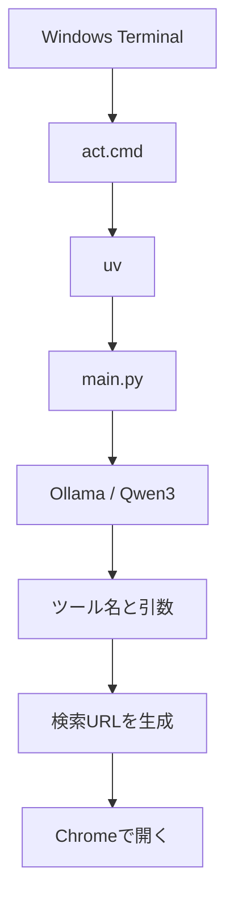

# Local Actions

GoogleのFunctionGemma Mobile Actionsに着想を得た、個人用の自然言語ショートカットです。

Windows Terminalから日本語で指示すると、ローカル小型言語モデルが登録済みの操作と引数へ変換し、Chromeで検索やページ表示を実行します。専用GUIやChrome拡張は使用しません。

> Status: MVP開発中  
> Last updated: 2026-06-27

## 現在できること

次の操作は実装と動作確認が完了しています。

| 操作 | 関数 | 例 |
|---|---|---|
| Google検索 | `google_search(query)` | `act 生成AIの最新ニュースをGoogleで検索して` |
| Googleマップ検索 | `google_maps_search(query)` | `act 大分駅の近くのカフェを地図で探して` |
| X検索 | `x_search(query)` | `act XでFunctionGemmaを検索して` |
| 指定サイトを開く | `open_url(url)` | `act YouTubeを開いて` |
| ChatGPTを開く | `open_chatgpt()` | `act ChatGPTを開いて` |

次の操作は関数だけ定義されており、まだ未実装です。

| 操作 | 関数 | 状態 |
|---|---|---|
| 表示中ページをメモへ追加 | `save_current_page()` | URL・タイトルの取得方法を検討中 |

## 完成時の利用イメージ

Windows Terminalを開き、どのフォルダにいても次のように実行します。

```powershell
act 大分駅の近くのカフェを地図で探して
```

モデルが次のようなツール呼び出しへ変換し、GoogleマップをChromeの新しいタブで開きます。

```json
{
  "operation": "google_maps_search",
  "query": "大分駅の近くのカフェ"
}
```

## 構成



各要素の役割は次のとおりです。

| 要素 | 役割 |
|---|---|
| `main.py` | 自然文の受け取り、Ollamaの呼び出し、ツール実行 |
| Ollama | ローカルモデルの実行基盤 |
| `qwen3:1.7b` | 日本語の指示からツールと引数を選択 |
| `uv` | Python、仮想環境、依存ライブラリの管理 |
| `act.cmd` | 長い起動コマンドを`act`として呼び出す入口 |
| Chrome | 検索結果や指定ページの表示。Windowsの既定ブラウザとして使用 |

## 使用環境

今回、動作を確認した環境です。

| 項目 | 内容 |
|---|---|
| OS | Windows |
| Python | 3.13.3 |
| Ollama | 0.30.11 |
| uv | 0.11.25 |
| モデル | `qwen3:1.7b` |
| モデル形式 | Q4_K_M量子化、約1.4GB |
| ブラウザ | Google ChromeをWindowsの既定ブラウザに設定 |

## セットアップ

### 1. Ollama

Windows版Ollamaをインストールします。

- <https://ollama.com/download/windows>

PowerShellを開き直し、動作を確認します。

```powershell
ollama --version
```

モデルを取得します。

```powershell
ollama pull qwen3:1.7b
```

確認:

```powershell
ollama list
```

### 2. uv

WinGetでuvをインストールします。

```powershell
winget install --id=astral-sh.uv -e
```

PowerShellを開き直し、動作を確認します。

```powershell
uv --version
```

### 3. Pythonプロジェクト

今回のプロジェクトは次の場所にあります。

```text
C:\Users\kyory\workspace
```

初期化:

```powershell
cd "$HOME\workspace"
uv init --app
uv add ollama
```

これにより、主に次のファイルとフォルダが作成されます。

```text
workspace/
├── .venv/
├── main.py
├── pyproject.toml
├── uv.lock
└── README.md
```

## 開発用の実行方法

プロジェクト内から直接実行する場合:

```powershell
cd "$HOME\workspace"
uv run main.py 大分駅の近くのカフェを地図で探して
```

引数を付けずに起動すると、`指示>`の入力待ちになります。

```powershell
uv run main.py
```

## `act`コマンド

### 目的

開発用の次のコマンドは長く、プロジェクトの場所も意識する必要があります。

```powershell
uv run --project "$HOME\workspace" "$HOME\workspace\main.py" ...
```

これを、どのフォルダからでも次の形で実行できるようにしています。

```powershell
act ...
```

### 配置場所

現在の`act.cmd`は次の場所にあります。

```text
C:\Users\kyory\AppData\Local\Microsoft\WinGet\Links\act.cmd
```

`Get-Command uv`で、同じフォルダにある`uv.exe`が使用されていることを確認しました。

```powershell
(Get-Command uv).Source
```

確認されたパス:

```text
C:\Users\kyory\AppData\Local\Microsoft\WinGet\Links\uv.exe
```

このフォルダが環境変数`PATH`に含まれていれば、PowerShellは現在のフォルダに関係なく`act.cmd`を発見できます。PATHは再帰的には検索されないため、`act.cmd`はPATH対象フォルダの直下に置きます。

PATHの確認:

```powershell
$env:PATH -split ";" | Where-Object { $_ -like "*WinGet\Links*" }
```

コマンド解決の確認:

```powershell
Get-Command act
```

### `act.cmd`の内容

```bat
@echo off
"%~dp0uv.exe" run --project "%USERPROFILE%\workspace" "%USERPROFILE%\workspace\main.py" %*
```

各部分の意味:

| 記述 | 意味 |
|---|---|
| `@echo off` | 内部で実行するコマンドを画面に表示しない |
| `%~dp0uv.exe` | `act.cmd`と同じフォルダにある`uv.exe` |
| `%USERPROFILE%\workspace` | 現在のユーザーのプロジェクトフォルダ |
| `%*` | `act`の後ろに入力されたすべての引数 |

`act.cmd`を別のPATH対象フォルダへ移す場合は、`uv`もPATHから解決できます。

```bat
@echo off
uv run --project "%USERPROFILE%\workspace" "%USERPROFILE%\workspace\main.py" %*
```

## PowerShellプロファイル方式について

最初は、PowerShellのプロファイルに次の関数を登録する方法を試しました。

```powershell
function act {
    uv run --project "$HOME\workspace" "$HOME\workspace\main.py" @args
}
```

対象ファイル:

```text
C:\Users\kyory\OneDrive\ドキュメント\WindowsPowerShell\Microsoft.PowerShell_profile.ps1
```

しかし、この環境ではPowerShellスクリプトの実行が無効で、プロファイルを読み込めませんでした。

```text
PSSecurityException: このシステムではスクリプトの実行が無効
```

`CurrentUser`の実行ポリシーを`RemoteSigned`へ変更すれば利用できますが、その変更は`act`だけでなく、現在のユーザーが実行するすべてのPowerShellスクリプトに影響します。

今回は影響範囲を限定するため、PowerShellプロファイル方式を採用せず、`act.cmd`方式へ切り替えました。

プロファイルに上記の`act`関数だけを追加している場合、その関数は不要です。ほかの設定がある場合はファイル全体を削除せず、`act`関数だけを削除します。

現在のPowerShellセッションに古い関数が残っている場合:

```powershell
Remove-Item Function:\act -ErrorAction SilentlyContinue
```

## モデル選定

### なぜ最初からFunctionGemmaを使わなかったか

FunctionGemmaはGemma 3 270Mを関数呼び出し向けに調整したモデルで、今回の構想に最も近いモデルです。一方、GoogleのMobile Actions公開データセットは英語で、FunctionGemmaは用途固有の追加学習を前提としています。

初期MVPでは、まず次を検証する必要がありました。

1. 日本語の自然文を理解できること
2. 登録済みツールから適切なものを選べること
3. 日本語の検索語を引数として保持できること
4. Ollamaからすぐ実行できること

このため、100以上の言語とツール利用に対応し、Ollama公式ライブラリから取得できる`qwen3:1.7b`を暫定採用しました。

これは最終モデルの決定ではありません。操作ログと修正データが蓄積した段階で、FunctionGemmaなどの小型専用モデルへ移行する余地を残しています。

### 量子化

現在の`qwen3:1.7b`はQ4_K_M量子化済みで、保存容量は約1.4GBです。

量子化済みモデルはMVPの実行確認に使います。将来ファインチューニングする場合は、Ollama上の量子化モデルを直接学習するのではなく、元モデルまたは学習用形式を使って追加学習し、その成果物を改めて量子化してOllamaへ載せる想定です。

## 実装上の判断

### OllamaのTool Callingを使用

最初の確認では、モデルへ操作一覧を文章で渡し、JSONだけを返すよう指示しました。

```json
{
  "operation": "google_maps_search",
  "query": "大分駅の近くにあるカフェ"
}
```

その後のPython実装では、文字列としてJSONを書かせる方式ではなく、Ollama公式のTool Callingを使用しています。Python関数の名前、説明、引数をOllamaへ渡し、モデルの`tool_calls`から選択結果を取得します。

### 日本語保持

初回テストでは操作の選択自体は成功しましたが、検索語の一部が中国語へ翻訳されました。

```json
{
  "operation": "google_maps_search",
  "query": "大分駅 附近 咖啡馆"
}
```

システム指示へ次を加えることで、日本語を保持できることを確認しました。

```text
引数では依頼文の日本語を保持し、他言語へ翻訳しないでください。
```

### Thinkingを無効化

ツール選択は短い分類・引数抽出タスクであり、長い推論は不要です。Ollama呼び出しでは次を指定しています。

```python
think=False
options={"temperature": 0}
```

これにより、思考出力を止め、同じ入力に対する結果を安定させています。

### URL生成

モデルに検索URL全体を作らせず、モデルは操作と検索語だけを決定します。URLの形式はPython側で固定しています。

| 操作 | URL |
|---|---|
| Google検索 | `https://www.google.com/search?q=...` |
| Googleマップ | `https://www.google.com/maps/search/?api=1&query=...` |
| X検索 | `https://x.com/search?q=...&src=typed_query` |
| ChatGPT | `https://chatgpt.com/` |

検索語は`urllib.parse.urlencode`でURLエンコードします。

### Chromeの起動

Python標準ライブラリの`webbrowser.open_new_tab()`を使っています。Windowsの既定ブラウザがChromeであることを前提としています。

## ここまでの作業履歴

1. WindowsでPython 3.13.3が利用できることを確認
2. WSL側ではなくWindowsネイティブ版Ollamaを導入
3. Ollama 0.30.11の動作を確認
4. `qwen3:1.7b`を取得
5. Ollama対話画面で自然文からJSONへの変換を検証
6. 初回出力の中国語化を発見
7. 日本語保持の指示を追加し、期待するJSONを確認
8. WinGetでuv 0.11.25を導入
9. `C:\Users\kyory\workspace`をuvアプリとして初期化
10. `ollama` Pythonライブラリを追加
11. `main.py`でOllamaのTool Callingを実装
12. Googleマップ検索をChromeで開けることを確認
13. Google検索、X検索、ChatGPT、YouTubeの動作を確認
14. PowerShellプロファイルによる`act`関数を試行
15. 実行ポリシーの影響を避けるため、`act.cmd`へ変更
16. PATH上のフォルダから`act`を呼び出す構成を確認

## 動作確認

```powershell
act 生成AIの最新ニュースをGoogleで検索して
act 大分駅の近くのカフェを地図で探して
act XでFunctionGemmaを検索して
act ChatGPTを開いて
act YouTubeを開いて
```

確認済みの内容:

- 適切なツールが選ばれる
- 日本語の検索語が維持される
- 検索語がURLエンコードされる
- Chromeの新しいタブが開く
- プロジェクト外のフォルダから`act`を実行できる

## 現在の制約

- `save_current_page()`は未実装
- Chrome以外が既定ブラウザの場合、そのブラウザで開く
- モデルの誤判定に対する確認画面や訂正操作はない
- 実行ログと修正履歴はまだ保存していない
- Ollamaが停止している場合の案内は未実装
- モデル出力が想定外だった場合のエラー処理は最低限
- `open_url`を含め、選ばれた操作は確認なしで即時実行される
- `act.cmd`をWinGet管理下のLinksフォルダへ便宜上置いている

## 次の作業

### MVPに必要

1. Chromeで現在表示しているページのURLとタイトルを取得する
2. 保存先とMarkdown形式を決める
3. `save_current_page()`を実装する
4. Ollama未起動、ツール未選択などの最低限のエラー表示を追加する
5. 一連の操作を再確認する

Chrome拡張を使わず現在ページを取得する方法は、Windows UI Automation、Chrome DevTools Protocol、クリップボード操作などを比較して決定します。

### MVP後

1. 入力、選択されたツール、引数、実行結果をログへ保存
2. 誤判定をユーザーが訂正できる仕組みを追加
3. 修正前後のデータを学習形式へ変換
4. ツールごとの評価用テストセットを作成
5. Qwen3のサイズ・量子化別精度を比較
6. FunctionGemmaを日本語の個人データでファインチューニング
7. 学習済みモデルを量子化し、Ollamaから実行

## セキュリティ上の注意

現在の操作は検索やページ表示に限定されています。将来、ファイル削除、メール送信、投稿などの副作用が大きい操作を追加する場合は、モデルの判断だけで即時実行せず、実行前の確認を必須にします。

また、ツール名はPython側で登録した一覧に限定します。モデルが任意のPowerShellコマンドやPythonコードを生成・実行する設計にはしません。

## 参考資料

- [FunctionGemma model overview](https://ai.google.dev/gemma/docs/functiongemma)
- [FunctionGemma Mobile Actions fine-tuning guide](https://ai.google.dev/gemma/docs/mobile-actions)
- [Google Mobile Actions dataset](https://huggingface.co/datasets/google/mobile-actions)
- [Ollama Tool Calling](https://docs.ollama.com/capabilities/tool-calling)
- [Ollama Structured Outputs](https://docs.ollama.com/capabilities/structured-outputs)
- [Ollama Windows](https://docs.ollama.com/windows)
- [uv documentation](https://docs.astral.sh/uv/)
- [PowerShell execution policies](https://learn.microsoft.com/en-us/powershell/module/microsoft.powershell.core/about/about_execution_policies)
